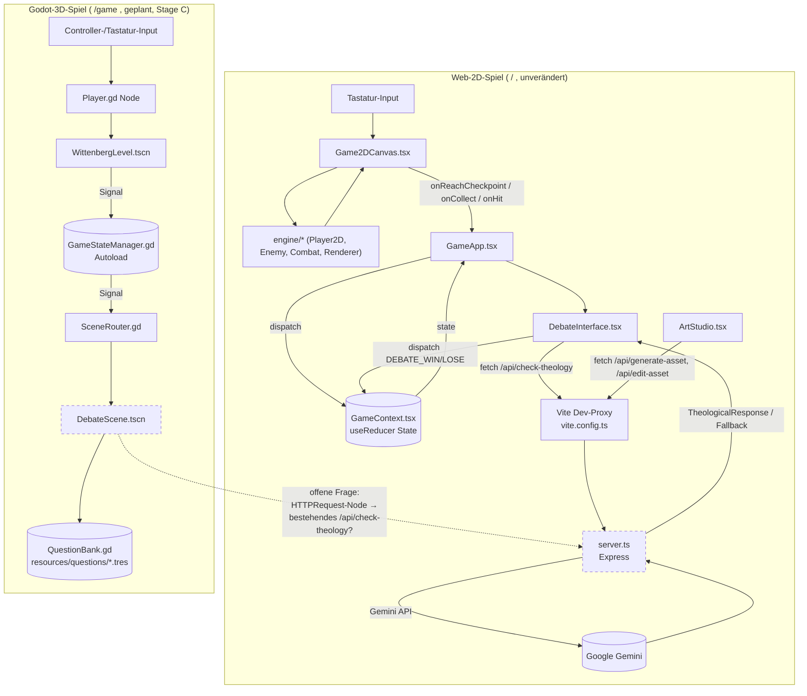

# Spiel-Architektur: Web-2D-Spiel und Godot-3D-Spiel

Stand: 2026-06-30, Branch `chore/game-foundation-planning`.

Dieses Dokument beschreibt zwei Architekturen nebeneinander:

1. Die **Ist-Architektur** des bestehenden Web-2D-Spiels (Repo-Root), verifiziert per Code-Lesen und über den Code-Review-Graph (CRG).
2. Die **Ziel-Architektur** des neuen Godot-4.x-3D-Desktop-Spiels unter `/game`, das gemäß [ADR 001](adr/001-godot-desktop-engine.md) additiv entsteht. `/game` existiert zum Zeitpunkt dieses Dokuments **noch nicht** auf der Festplatte (Stage A: Planung, keine Codeänderung) — Abschnitt 2 ist Zielbild, kein Ist-Zustand.

Grundlage für Abschnitt 1: [`docs/00-discovery/repository-audit.md`](../00-discovery/repository-audit.md) sowie direkte Prüfung von `App.tsx`, `GameApp.tsx`, `context/GameContext.tsx`, `server.ts`, `types.ts`, `vite.config.ts` und ein CRG-Architektur-Scan. Realer Tool-Output (`build_or_update_graph_tool`, `full_rebuild`, Stand 2026-06-30):

```
{"status":"ok","build_type":"full","summary":"Full build complete: parsed 25 files, created 134 nodes and 855 edges.",
 "files_parsed":25,"total_nodes":134,"total_edges":855}
```

`get_architecture_overview_tool`/`list_communities_tool` (dieselbe Sitzung) gruppieren davon 98 Nodes in 7 Communities (Rest sind File-/Top-Level-Nodes außerhalb der Community-Cluster) — siehe Tabelle unten, Werte direkt aus dem Tool-Output übernommen.

## 1. Ist-Architektur: Web-2D-Spiel (Repo-Root)

### 1.1 Überblick

Trotz der (veralteten) Beschreibung in `CLAUDE.md`/`metadata.json` als "3D-Spiel (React Three Fiber/Three.js)" ist der reale Stand ein **2D-Canvas-Spiel**: React 19 + Vite-Frontend, Express-5-Backend als Gemini-Proxy. Keine Three.js-/`@react-three/fiber`-Dependency in `package.json`.

Der CRG-Architektur-Scan bestätigt die funktionale Aufteilung über sieben Communities:

| Community | Größe (Nodes) | Sprache | Entspricht |
|---|---|---|---|
| `engine-draw` | 51 | TypeScript | `engine/*` — 2D-Render-/Spiellogik (Player, Enemy, Combat, Renderer) |
| `components-handle` | 27 | TSX | `components/*` — React-UI-Komponenten |
| `services-audio` | 9 | TypeScript | `services/audio.ts` |
| `context-game` | 3 | TSX | `context/GameContext.tsx` |
| `luther-game-generate` | 3 | TypeScript | `server.ts`-Routen rund um Asset-Generierung |
| `luther-game-response` | 3 | TypeScript | `server.ts`-Response-Handling |
| `verification-verify` | 2 | Python | `verification/*.py` (manuelle visuelle Checks, kein Testframework) |

Der Scan meldet eine **hohe Kopplung** (17 Kanten) zwischen `components-handle` und `engine-draw` — UI-Komponenten rufen Engine-Funktionen direkt auf (z. B. `Game2DCanvas.tsx` orchestriert `engine/Player2D.ts`, `engine/Enemy.ts`, `engine/Combat.ts`, `engine/*Renderer.ts` für den Canvas-Draw-Loop). Das ist als Graph-Hinweis zu werten, nicht als isoliert vermessenes Laufzeitverhalten — die Kopplung selbst ist für ein 2D-Canvas-Spiel architektonisch erwartbar (Render-Loop braucht direkten Zugriff auf Spielobjekte).

### 1.2 State-Management: React Context + `useReducer`

Zentral in [`context/GameContext.tsx`](../../context/GameContext.tsx):

- `State`-Interface hält `gameState`, `currentQuestionIndex`, `score`, `health`/`maxHealth`, `customTexture`, `flash`, `resources` (`scholarlyQuotes`, `ink`), `impactScore`, `inventory`.
- `Action`-Union (`START_GAME`, `SET_GAME_STATE`, `COLLECT_GRACE`, `TAKE_DAMAGE`, `DEBATE_WIN`, `DEBATE_LOSE`, `NEXT_LEVEL`, `SET_CUSTOM_TEXTURE`, `CLEAR_FLASH`, `ADD_RESOURCE`, `SPEND_RESOURCE`, `ADD_IMPACT`, `HEAL`, `RESET_GAME`) plus reiner `gameReducer`.
- `GameProvider` (in `App.tsx` um `GameApp` gelegt) hält den `useReducer`-State; `useGame()` liefert `{ state, dispatch }` und wirft, wenn außerhalb des Providers verwendet.
- Konsumenten (`GameApp.tsx` und Kindkomponenten wie `DebateInterface`, `MapInterface`, `ArtStudio`) lesen `state` und mutieren ausschließlich über `dispatch({ type, payload })` — deckungsgleich mit der Hard Rule in `CLAUDE.md` ("never mutate `GameContext` state directly").

### 1.3 Game-State-Maschine

`GameState`-Enum (`types.ts`): `MENU`, `PLAYING`, `DEBATE`, `ART_STUDIO`, `VICTORY`, `GAME_OVER`, `MAP`, `PAUSED`, `DIALOG`. `PAUSED` und `DIALOG` sind deklariert, aber im aktuell gelesenen `GameApp.tsx`/`gameReducer` nicht verdrahtet (kein Dispatch-Pfad dorthin) — vermutlich für künftige Erweiterungen vorgesehen, hier als offener Punkt vermerkt statt als genutzter Zustand behauptet.

Tatsächlich verdrahtete Übergänge (`GameApp.tsx` + `gameReducer`):

- `MENU` → `PLAYING` (`START_GAME`-Button)
- `MENU` → `ART_STUDIO` / `MAP` (Buttons), zurück → `MENU` (`SET_GAME_STATE`/`RESET_GAME`)
- `PLAYING` → `DEBATE` (`onReachCheckpoint`-Callback aus `Game2DCanvas` → `SET_GAME_STATE`)
- `DEBATE` → Erfolg: `DEBATE_WIN` + `NEXT_LEVEL` → nächste Frage als `PLAYING`, oder `VICTORY` wenn `currentQuestionIndex` bereits letzter `QUESTIONS`-Index war
- `DEBATE` → Misserfolg: `DEBATE_LOSE` (Health-Abzug, `gameState` bleibt unverändert lt. Reducer)
- `PLAYING`: `TAKE_DAMAGE` setzt bei `health === 0` `GAME_OVER`
- `GAME_OVER`/`VICTORY` → `MENU` über `RESET_GAME`

### 1.4 Datei-Organisation

```
/                       Repo-Root (Web-Spiel, unverändert lt. ADR 001)
├── App.tsx             Einstieg: <GameProvider><GameApp /></GameProvider>
├── GameApp.tsx          Haupt-UI-Orchestrierung, alle GameState-Verzweigungen
├── context/
│   └── GameContext.tsx  State + Reducer + Provider/Hook
├── components/          React-UI (Game2DCanvas, HUD2D, DebateInterface,
│                         ArtStudio, MapInterface, ErrorBoundary)
├── engine/               2D-Spiellogik (Player2D, Enemy, Combat,
│                         EnemyRenderer, ItemRenderer, TileRenderer)
├── hooks/                useCanvasDrawing.ts
├── services/             audio.ts, gemini.ts (Frontend-seitiger API-Client)
├── verification/         Python-Skripte für manuelle visuelle Prüfungen (kein Testframework)
├── constants.ts          COLORS, GAME_CONFIG, QUESTIONS (einzige Quelle für Tunables/Content)
├── types.ts              GameState, Direction, Enemy/Item/Map-Typen, Props-Interfaces
├── server.ts             Express-Backend (Gemini-Proxy, siehe 1.5)
└── vite.config.ts         Dev-Server-Proxy /api → localhost:3000, Alias @ → Root
```

### 1.5 Express-Backend-Routen (`server.ts`)

| Route | Zweck | Gemini-Modell | Fallback bei Fehler |
|---|---|---|---|
| `POST /api/check-theology` | Validiert Schüler-Antwort gegen Sola-Gratia-Lehre | `gemini-2.5-flash-lite-latest` | `DEFAULT_THEOLOGICAL_ERROR` |
| `POST /api/deep-dive` | Vertiefende theologische Erklärung | `gemini-2.0-flash-thinking-exp-01-21` | `{ text: DEFAULT_DEEPDIVE_ERROR }` |
| `POST /api/generate-asset` | Bild-Asset-Generierung fürs Atelier (`ArtStudio`) | `gemini-2.0-flash` | `{ imageUrl: null }` |
| `POST /api/edit-asset` | Bild-Asset-Bearbeitung (multimodal) | `gemini-2.0-flash` | `{ imageUrl: null }` |

Jede Route ist in `try/catch` gekapselt und liefert im Fehlerfall ein valides Fallback-Objekt statt eines rohen Wurfs an den Client — deckungsgleich mit der Hard Rule in `CLAUDE.md`. Modellwahl ist pro Route bewusst gepinnt (Validierung vs. Deep-Reasoning vs. Bildgenerierung); im Code finden sich mehrere Kommentare, die frühere Modell-Umstellungen dokumentieren (`server.ts` Zeilen 128–172) — ein Hinweis auf vorangegangene Iteration, kein aktueller Funktionsfehler.

## 2. Ziel-Architektur: Godot-3D-Spiel (`/game`)

**Status: geplant, noch nicht implementiert.** Diese Struktur ist das in Stage C (siehe ADR 001, Migrationsplan) umzusetzende Zielbild, abgeleitet aus gängiger Godot-4.x-Projektkonvention und den projektspezifischen Anforderungen (Wittenberg-/Reformations-Setting, Kenney/Quaternius-Lowpoly-Assets, theologischer Debattenmodus analog zum Web-Spiel).

### 2.1 Geplante Verzeichnisstruktur

```
/game
├── project.godot           Godot-4.x-Projektdatei
├── export_presets.cfg       Desktop-Export-Targets (macOS/Windows/Linux)
├── assets/                  Importierte 3D-Modelle/Texturen/Audio
│   ├── buildings/           Übernahme aus godot_assets/buildings/ (Kenney Castle Kit,
│   │                         Quaternius Medieval Village MegaKit) — erst nach
│   │                         Lizenzprüfung (License.txt) und .import-Konvertierung
│   ├── characters/
│   ├── props/
│   └── audio/
├── scenes/                  .tscn-Szenen, eine pro Bildschirm/Level
│   ├── Main.tscn             Root-Szene, lädt Sub-Szenen je nach Game-State
│   ├── menu/MainMenu.tscn
│   ├── world/WittenbergLevel.tscn   3D-Lauf-/Erkundungs-Level (Analog zu Game2DCanvas)
│   ├── debate/DebateScene.tscn      Theologische Debatte (Analog zu DebateInterface)
│   └── ui/HUD.tscn
├── scripts/                  GDScript, gespiegelt zur Szenenstruktur
│   ├── autoload/              Singletons (siehe 2.2)
│   ├── entities/               Player.gd, Enemy.gd, NPC.gd
│   └── ui/
├── resources/                Custom Godot-Resources (.tres)
│   └── questions/             Theologie-Fragenkatalog als .tres oder JSON
│                               (Ziel-Pendant zu constants.ts QUESTIONS, siehe Abschnitt 3)
└── tests/                    Test-Suite (Framework-Wahl offen — GUT/GdUnit4 — Folgearbeit)
```

### 2.2 Autoload-Singletons für Game-State

Godot kennt keinen React-Context; das funktionale Äquivalent zu `GameContext.tsx` sind **Autoload-Singletons** (global über `project.godot` registriert, projektweit als `GameStateManager.foo()` ansprechbar):

| Autoload (geplant) | Web-Pendant | Verantwortung |
|---|---|---|
| `GameStateManager.gd` | `context/GameContext.tsx` (State + Reducer) | Hält `current_state` (Godot-Enum analog `GameState`), Score, Health, Inventory; exponiert Methoden statt `dispatch()` (z. B. `collect_grace()`, `take_damage()`) oder ein eigenes Signal-basiertes Event-System |
| `QuestionBank.gd` | `constants.ts` `QUESTIONS` | Lädt den Fragenkatalog aus `resources/questions/` |
| `AudioManager.gd` | `services/audio.ts` | Zentrale SFX-/Musik-Wiedergabe |
| `SceneRouter.gd` | `GameApp.tsx`-Verzweigung über `gameState` | Szenenwechsel (`change_scene_to_file`) anhand `GameStateManager.current_state`, ersetzt die JSX-Conditional-Renders aus `GameApp.tsx` |

Diese Aufteilung ist eine Empfehlung, keine bereits getroffene Implementierungsentscheidung — die genaue Granularität (ein großer Singleton vs. mehrere) ist Teil der Stage-C-Umsetzung.

## 3. Schnittstellen und Trennung

- **Keine geteilte Codebasis.** Web-Teil (Node/npm/TypeScript) und Godot-Teil (GDScript/Godot-Editor) sind vollständig getrennte Toolchains; es gibt keinen gemeinsamen Build- oder Importmechanismus zwischen `/` und `/game`.
- **Inhaltliche Duplizierung statt Code-Sharing:** Der theologische Content (`constants.ts` `QUESTIONS`, aktuell 3 Einträge: Werkgerechtigkeit/Mt 7,21, Papst-Primat/Mt 16,18, freier Wille/Röm 3,23) muss für Godot in einem dort lesbaren Format (`.tres` oder JSON) vorgehalten werden. Laut ADR 001 ist offen, ob das **manuell dupliziert** oder **per Build-Schritt aus `constants.ts` generiert** wird — explizit als Folgearbeit benannt, keine Festlegung in diesem Dokument.
- **Offene Frage — HTTP-Brücke zum bestehenden Theologie-Backend:** `server.ts` validiert Antworten aktuell nur für das Web-Frontend (`/api/check-theology`, `/api/deep-dive`). Ob das Godot-Spiel denselben Express-Server per `HTTPRequest`-Node konsumiert (Wiederverwendung der Gemini-Validierungslogik) oder eine eigene, GDScript-seitige Anbindung an Gemini erhält, ist **nicht entschieden**. ADR 001 hält diese Möglichkeit offen, ohne sie festzulegen. Folgefragen, falls eine HTTP-Brücke gewählt wird: CORS-Konfiguration für einen Desktop-Client (kein Browser-Origin), Erreichbarkeit von `localhost:3000` aus einer exportierten Desktop-Anwendung (kein Dev-Proxy wie in `vite.config.ts`), und ob `API_KEY`/`GEMINI_API_KEY` weiterhin ausschließlich serverseitig verbleiben (siehe Hard Rule: niemals `GEMINI_API_KEY` im Client/Godot-Build loggen oder einbetten).
- **Getrennte CI:** Bestehende Checks (`npm run build`, künftig `tsc --noEmit`, siehe Risk-Register) bleiben unverändert für `/`. Für `/game` ist laut ADR 001 eine eigene Pipeline (`godot-validate.yml`) vorgesehen, die Godot 4.x von GitHub Releases lädt und headless validiert — unabhängig vom Node-Workflow.
- **Getrennte Asset-Pipelines:** Web-Assets (2D-Sprites/Sounds) bleiben im bestehenden `public`/Komponenten-Workflow; 3D-Assets kommen aus `godot_assets/` (lokal, git-ignoriert) und werden erst nach Lizenzprüfung gezielt nach `/game/assets/` übernommen. Die Lizenzprüfung ist erfolgt (Issue #10, 2026-07-01): [`docs/assets/asset-license-audit.md`](../assets/asset-license-audit.md) — **nur `APPROVED`/`APPROVED_WITH_ATTRIBUTION`-Assets** dürfen importiert werden.

## 4. Datenfluss-Diagramm



Die gestrichelte Verbindung markiert die in Abschnitt 3 beschriebene **ungeklärte** HTTP-Brücke — sie ist kein implementierter Datenfluss, sondern eine architektonische Option, die in einer separaten Entscheidung (eigenes Issue/ADR) zu klären ist.

## 5. Begründung der Verzeichnistrennung (Verweis auf ADR 001)

Die Trennung in `/` (Web-2D-Spiel) und `/game` (Godot-3D-Spiel) als zwei parallele, additive Codebasen im selben Repository ist in [ADR 001](adr/001-godot-desktop-engine.md) begründet und hier nicht erneut zur Disposition gestellt. Kernpunkte aus der ADR, die diese Architektur direkt prägen:

- Der Auftrag (echtes 3D-**Desktop**-Spiel) lässt sich im bestehenden Web-Stack nicht erfüllen (React Three Fiber wäre 3D-**Web**, keine Desktop-Distribution) — daher eine dedizierte Engine statt Erweiterung des bestehenden Stacks.
- **Kein Code-Sharing auf Engine-Ebene** ist eine bewusste Konsequenz, keine Lücke: TypeScript/React und GDScript/Godot-Szenengraph sind strukturell zu verschieden, um sinnvoll Code zu teilen; geteilt wird ausschließlich Content (theologische Inhalte, ggf. Backend-API).
- **Isolation ermöglicht Rollback:** Da `/game` rein additiv ist, kann es laut ADR 001 jederzeit folgenlos entfernt werden, falls sich Godot/GDScript als ungeeignet erweist — der bestehende Web-Teil bleibt unberührt. Diese Rückbaubarkeit wäre bei einer Vermischung der Codebasen (z. B. gemeinsamer Build-Pipeline) nicht gegeben.
- Die Verzeichnistrennung spiegelt auch die **Toolchain-Trennung**: Mitwirkende am Web-Teil brauchen nur Node/npm, Mitwirkende am Godot-Teil nur den Godot-Editor — niemand muss zwingend beide Stacks beherrschen, um an einem der beiden Teile zu arbeiten.
- Die bereits vorhandenen `godot_assets/` (Kenney/Quaternius, lowpoly, passend zum Wittenberg-Setting) wurden als reales Signal für die Engine-Wahl gewertet, nicht nur als offene Asset-Frage — sie fließen ausschließlich in `/game/assets/` ein, nie in den Web-Teil.

## 6. Format-Entscheidung: Quest-/Dialog-Datenmodell (M2, Issue #14)

Für das Quest-/Dialog-Datenmodell des Godot-Spiels standen zwei native Godot-4.x-Optionen zur Wahl (siehe Issue #14 und Roadmap M2). Die Entscheidung ist hier verbindlich getroffen:

**Entscheidung: JSON auf Platte als Serialisierungsformat, plus eine typisierte GDScript-Modellklasse (`class_name QuestStation extends Resource`) als Zugriffsschicht.**

| Kriterium | `.tres` (Godot-`Resource`-Instanzen) | **JSON + typisiertes Modell (gewählt)** |
|---|---|---|
| Editor-Inspector-Integration | ja, nativ | nein (JSON wird über Loader geparst); Typsicherheit kommt aus der `QuestStation`-Klasse |
| Typsicherheit für Konsumenten (#15/#16) | ja | ja — `QuestStation` mit `@export`-Feldern + `from_dict()` |
| Generierbarkeit `constants.ts` → Godot (Risk 6) | schlecht — `.tres` ist ein Godot-spezifisches Serialisierungsformat, das ein Generator nur umständlich erzeugt | **gut — JSON ist trivial aus einem TS-Modul zu emittieren** |
| Diff-/Review-Tauglichkeit | mäßig (Ressourcen-Metadaten im Diff) | **gut — reiner Text-Diff** |
| Konsistenz mit Bestand | — | **hoch — spiegelt das in M1 etablierte `theology_questions.json` + `TheologyData`-Autoload-Muster** |

**Begründung (Risk Register Risiko 6 — Doppelpflege theologischer Inhalte):** Eine reine `.tres`-Lösung würde einen späteren automatisierten Single-Source-of-Truth-Generator (`constants.ts` → Godot) strukturell erschweren, da `.tres` nicht ohne Godot-Werkzeuge sinnvoll erzeugbar ist. JSON hält diese Generator-Pipeline offen. Gleichzeitig liefert die typisierte `QuestStation`-Klasse die Vorteile einer `Resource` (typsichere Felder, stabile API, optional später als `.tres` authorbar), ohne pro Eintrag eine Datei zu erzwingen. Die Single-Source-of-Truth-Entscheidung selbst (manuelle Duplikation vs. Generator) bleibt bewusst Folgearbeit (Issue #15 / eigenes Risk-6-Issue) — die hier getroffene Formatwahl verbaut keine der beiden Varianten.

**Realisierung im Code (`/game`):**

| Baustein | Datei | Rolle |
|---|---|---|
| Typisiertes Modell | `game/scripts/data/quest_station.gd` | `QuestStation extends Resource` — Felder `id`, `title`, `question_text`, `scripture_reference` (Pendant zu Web-`Question`) plus 3D-/Quest-Felder `theology_question_id`, `world_position`, `order`, `prerequisites`, `next_on_success`; `static from_dict()` für defensives Parsen |
| Lade-/Parse-Logik | `game/scripts/autoload/quest_data.gd` (Autoload `QuestData`) | Liest `res://resources/quests/quest_stations.json`, baut `Array[QuestStation]`, bietet `get_station_by_id()` / `get_stations_in_order()` |
| Referenz-/Platzhalterdaten | `game/resources/quests/quest_stations.json` | Zwei Platzhalterstationen zur Schema-Validierung — **nicht** die echten 3 theologischen Fragen (das ist Issue #15) |
| Headless-Test | `game/tests/quest_data_test.gd` | Lädt die Daten zur Laufzeit, prüft Felder + Theologie-Verknüpfung, gibt Output aus; in `godot-validate.yml` verdrahtet |

Dies konkretisiert die in Abschnitt 2.2 skizzierte `QuestionBank.gd`-Idee: Der Autoload heißt `QuestData` und liegt unter `resources/quests/` (statt `resources/questions/`), da er generische Quest-/Dialogstationen modelliert, nicht nur den Fragenkatalog. Das schmale Web-`Question`-Interface (`id`, `text`, `context`) ist als Teilmenge vollständig abgedeckt; die 3D-/Quest-Felder sind additiv und brechen kein Schema für Issue #15 (Content-Migration) oder Issue #16 (Debatten-UI).
